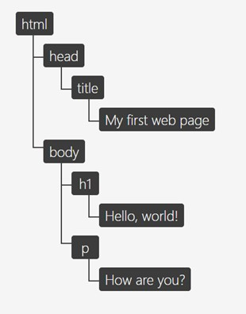
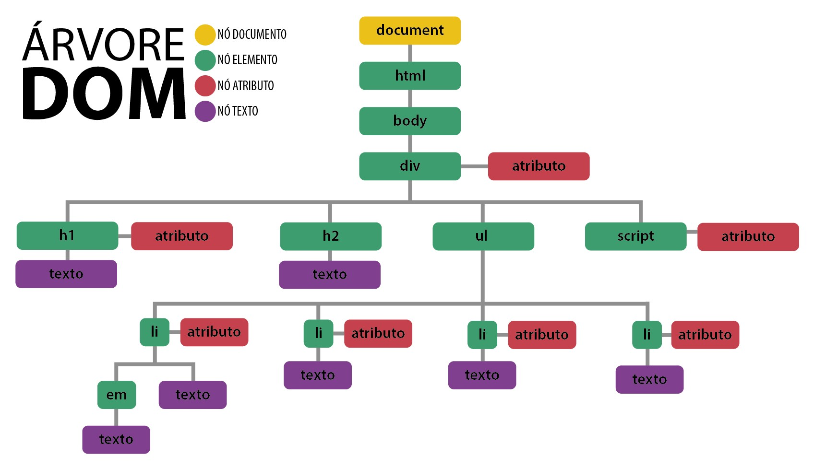

# Javascript II - Usando o DOM


### Façam suas perguntas através do DontPad

[http://dontpad.com/on13-js2](http://dontpad.com/on13-js2)

----
Vamos aprender ou retomar nessa semana:
- *Revisão*
- [Arrow functions - funções de flecha -](#function)
- [Árvore DOM](#tree)
- [Selecionando elementos no HTML](#select)
    - [ ]  .getElementById 
    - [ ]  .getElementsByClassName
    - [ ]  .getElementsByTagName 
    - [ ]  .querySelector 
    - [ ]  .querySelectorAll  
- [Manipulando conteúdo](#changingContent)
    - [ ]  .textContent
    - [ ]  .innerText
    - [ ]  .innerHTML
    - [ ]  .value (inputs)
- [Alterando estilos](#changingStyle)
    - [ ]  .style.property (camelCase)
    - [ ]  .classList
        - [ ]  .add()
        - [ ]  .remove()
        - [ ]  .toggle()
- [Trabalhando com propriedades dos elementos](#elementProps)  
    - [ ]  .setAtrribute()
    - [ ]  .getAtrribute()
    - [ ]  .removeAttribute() 
- [Criando elementos, inserindo e removendo no HTML](#createElement)
    - [ ]  .createElement() - criar
    - [ ]  .append() / .appendChild() - inserir
    - [ ]  .prepend() - inserir
    - [ ]  .remove() / .removeChild() - remover
- [Navegando pelos elementos](#navigateElements)
    - [ ]  Parents (.parentNode, .parentElement ) 
    - [ ]  Children (.children, .childNodes, .firstElementChild, .lastChild) 
    - [ ]  Siblings (.nextSibling, .nextElementSibling,  .previousSibling, .previousElementSibling )
- [Funções de eventos](#event)
    - [ ]  Com a `chamada` direto no HTML
    - [ ]  .addEventListener() 
        - [Tipos de eventos - Site MDN](https://developer.mozilla.org/pt-BR/docs/Web/Events) 
        - event.preventDefault() - em formulários -
- [links úteis](#links)
----

<a id="function"></a>

## **arrow functions!**

Você sabia que é possível declarar uma função de um jeito diferente? Sim, para isso nós utilizamos as arrows functions!

Uma expressão arrow function possui uma sintaxe mais curta quando comparada a uma expressão de função. 

A sua sintaxe mais comum é essa:

``` Javascript
const minhaFuncao = (param1, param2, ...) => {
  //passos da minha função

  return meuResultado
}
```

E ela pode ser ainda mais diminuta! Se a função tem apenas um único parâmetro e esse parâmetro retorna um valor, você pode remover as chaves e a palavra `return`.


``` Javascript
const minhaFuncao = (param1) => meuResultado;
```

Aliás, a arrow function pode ser escrita ainda nesse formato ainda mais simples - **que nós vamos usar bastante quando tratarmos sobre métodos de array**:

``` Javascript
(param1) => meuResultado; // um jeito

(param1) => {
  return meuResultado
};

```
---
<a id="tree"></a>

# DOM - Document Object Model


## O que é DOM ?

DOM é uma sigla que significa **Document Object Model (Objeto Modelo do Documento).**  Quando a página é carregada o browser cria um objeto que representa os elementos da página a partir do **HTML.**


O objeto `window` representa uma janela que *contém um elemento DOM*; a propriedade `document` aponta para o documento DOM document carregado naquela janela. 

O DOM é uma representação de uma página HTML e de todos os seus conteúdos. Por isso, ele se assemelha a uma árvore cujos galhos são nós, onde cada tag e conteúdo geram um nó. 



**IMPORTANTE**: **o DOM não pertence nem ao HTML, nem ao JavaScript**. Ele é apenas um conjunto de regras implementado pelos principais navegadores. O seu conteúdo é alimentado pelo arquivo em HTML, e ele é consumido pelo nosso script, mas isso não quer dizer que ele pertença ao HTML ou ao JavaScript.

Tudo em uma página HTML é um nó em uma árvore do DOM, de onde podem surgir ainda outros nós filhos. Cada elemento HTML é um nó. O texto dentro de um elemento HTML é um nó filho da tag em que está inserido. Cada comentário é um nó de comentário dentro da árvore do DOM.

Assim, o DOM é composto por quatro tipos principais de nós:


- **Document** - representa o documento HTML.
- **Element** - são todas as tags que estão no arquivo HTML e se transformam em elementos da árvore DOM.
- **Text** - é o conteúdo de texto que vai entre os elementos (tags).
- **Attribut** - são os todos atributos para um nó específico. No caso, o attribute class="HERO" está associado ao elemento, outros exemplos de atributos são o href, o id, entre outros.



---

## Manipulando o DOM

Por que é tão importante entender o que é o DOM e como ele funciona? Para que possamos manipular conteúdo, estrutura e estilo, bem como criar eventos dentro da página HTML por meio do JavaScript ou outras linguagens de programação.

Podemos manipular o DOM para realizar alterações na estrutura do HTML, alterar estilos, modificar conteúdos e adicionar diversos eventos.


---


<a id="select"></a>

# Métodos de seleção de elementos - HTML/DOM

Primeiramente, é importante destacar que os métodos de manipulação fazem a ligação entre os nós (elementos) e os eventos. 

São inúmeros os métodos de manipulação do DOM, cuja documentação se encontra nesse [link.](https://developer.mozilla.org/pt-BR/docs/Web/API/Document)

Mas, vamos concentrar os nossos estudos nos 5 métodos mais utilizados pelo JavaScript.

### **getElementById()**

Esse método retorna o elemento que estiver contendo o nome do ID informado. Como os IDs devem ser únicos, é um método muito útil para pegar apenas o elemento desejado.

Exemplo:

#### *HTML*

```HTML
 <div>
   <input type="text" id="textInput" class="text-input"  />
</div>
```

#### *JavaScript*

```js
let getInputId = document.getElementById('textInput');
```

### **getElementsByTagName()**

Uma coleção de todos elementos que contenham o nome da tag informada.

Exemplo:

#### *HTML*

```HTML
 <div>
   <input type="text" placeholder="Enter age" id="text"/>
</div>
```

#### *JavaScript*

```js
const getAge = document.getElementByTagName("text");
```

### **querySelector()**

Mais versátil, esse método retorna qualquer elemento do DOM, como classes, tags e ID's. 

Você apenas precisa deixar explicito se está chamando uma classe, um ID ou uma tag.

Exemplo:

#### HTML

```HTML
<div>
 <input type="text" id="textInput" class="text-input" />
</div>
```

#### Javascript

```js
let getInputId = document.querySelector('#textInput');
let getInputClass = document.querySelector('.text-input');
let getInputTag = document.querySelector('input');
```

### **querySelectorAll()**

Semelhante ao querySelector(), só que retorna um objeto representando os elementos do documento que correspondem ao seletor.

Se nenhum elemento coincide, a função retorna um objeto vazio. Se a string do seletor é inválida, querySelectorAll() lançará uma exceção.

### **Importante**:

Para selecionar apenas um elemento pelo `id`, é mais viável utlizar `document.getElementById` pois o mesmo é específico para essa finalidade. Caso precise de uma seleção mais avançada, use `document.querySelector` pelo fato de ter a liberdade de utilizar seletores CSS, o que é uma grande vantagem além de ser mais performático para o browser.

### **Sintaxe para seletores**:

```js
document.getElementById('nome-id');
//utilizar o nome do ID entre aspas

document.querySelector('.classe');
//utilizar o nome da classe entre aspas e acompanhada do ponto .

document.querySelector('#id');
//utilizar o nome do id entre aspas e utilizando a hashtag #

document.querySelector('div');
//utilizar o nome da tag entre aspas
```
### **getElementsByClassName()**

Esse método nos permite selecionar elementos do documento incluídos dentro do atributo class. 

Ele recebe um único argumento de string, que pode conter vários identificadores separados por espaços.

### **Outros métodos DOM**:

| Propriedade          | Descrição                                                                            |
| :------------------- | :----------------------------------------------------------------------------------- |
| documentElement      | Captura o elemento raiz <html> de um documento HTML.                                 |
| getElementById       | Busca um elemento da página Web com o uso do atributo id do elemento.                |
| querySelector        | Busca um elemento da página Web com o uso do atributo id, classe ou tag do elemento. |
| createElement        | Cria um nodo elemento na página.                                                     |
| createAttribute      | Cria um nodo atributo na página.                                                     |
| createTextNode       | Cria um nodo texto na página.                                                        |
| getElementsByTagName | Retorna um array dos elementos com o mesmo nome.                                     |
| appendChild          | Insere um novo elemento filho.                                                       |
| removeChild          | Remove um elemento filho.                                                            |
| parentNode           | Retorna o nodo pai de um nodo.                                                       |

---
<a id="changingContent"></a>

### Retornando e modificando conteúdo do DOM

```javascript
element.textContent();
// me retorna o conteúdo de texto do elementos com suas formatações feitas

element.textContent = "olá mundo"
// muda o valor do texto do elemento para olá mundo

element.innerHTML(); 
//mostra o valor do elemento em html 

element.innerHTML = "<strong>Olá</strong> mundo"
// muda o valor do meu elemento para Olá mundo (o olá aparecerá em negrito) e pode retornar novos elementos html dentro dele

element.innerText(); 
//tem propriedade semelhante ao .textContent() porém ele traz o texto sem formatações

input.value();
//retorna o valor do meu input 

```

---
<a id="changingStyle"></a>

## Métodos do DOM para manipular CSS

O DOM HTML permite que o JavaScript mude o estilo dos elementos HTML.

Para alterar o estilo de um elemento HTML, use esta sintaxe:

```javascript
elemento.style.property = "novo estilo"
```

---

## Adicionar e remover classes do HTML pelo Javascript

O Element.classList é uma propriedade somente leitura que retorna uma coleção com as classes do elemento.

```javascript
elemento.classList;
```

A propriedade classList é somente leitura, no entanto, você pode modificá-la usando os métodos add() e remove().

`contains()` Retorna um valor booleano, indicando se um elemento tem o nome da classe especificado. Valores possíveis:

- true - o elemento contém o nome da classe especificado
- false - o elemento não contém o nome da classe especificado

```javascript
elemento.classList.contains('classe');
```

`add()` Adiciona um ou mais nomes de classe a um elemento. Se a classe especificada já existir, a classe não será adicionada

```javascript
elemento.classList.add('classe');
```

`remove()` Remove um ou mais nomes de classe de um elemento. A remoção de uma classe que não existe, NÃO gera um erro

```javascript
elemento.classList.remove('classe');
```

---
<a id="elementProps"></a>

## Trabalhando com propriedades dos elementos  

Assim como modificamos o atributo(propriedade) de classe do nosso elemente usando o `.classList`, podemos modificar qualquer atributo dos nossos elementos HTML usando os métodos: 

```javascript
elemento.getAttribute('id');
// irá mostrar o valor de id que existe no elemento escolhido
```

```javascript
elemento.setAttribute('id', 'meu-elemento');
// o primeiro parâmetro diz qual é o atributo que se quer adicionar, no segundo é dado o seu valor
```

```javascript
elemento.removeAttribute('class');
// remove o atributo do meu elemento
```

<a id="createElement"></a>

## Criar, inserir e excluir elementos da árvore DOM.

A função `document.createElement()` aceita como parâmetro o nome da tag e retorna o elemento recém criado (mas ainda não inserido).

```javascript
let novaTag = document.createElement('p');
```

Inserimos o elemento com a função `appendChild()`, mas ainda precisamos criar um conteúdo (nó de texto) para o elemento `<p>`, caso contrário, estaremos inserindo apenas o elemento, sem texto. Para criar um nó de texto utilizaremos a função `document.createTextNode()`.

```javascript
let texto = document.createTextNode('meu texto novo');
```

Antes de inserir o elemento, devemos atribuir o nó de texto a ele. Ou seja, referenciar corretamente o elemento pai ao elemento filho.

```javascript
novaTag.appendChild(texto);
```

O Novo elemento existe e tem conteúdo, porém ainda não foi inserido no html existente. Para isso utilizaremos a função `document.querySelector('.nome-da-classe')` e selecionaremos o nó onde o novo elemento que criamos será inserido.

```javascript
let minhaDiv = `document.querySelector('.classe-da-div')`;
```

Ou seja, agora com o elemento completo, podemos então, anexá-lo a um elemento <div> já existente em nossa página HTML. A função `appendChild()` insere o novo elemento filho ao final do elemento pai.

```javascript
minhaDiv.appendChild(novaTag);
```

É possível inserir um elemento através da função insertBefore(), ela aceita dois parâmetros: o primeiro é o elemento filho e o segundo é o elemento que servirá de referência para inserir o elemento filho.
Para remover um elemento utilizamos a função removeChild().

## Sintaxe Criar elementos

```javascript
document.createElement("nome-da-tag") para criar um elemento
elementoPai.appendChild(elementoFilho) para inserir um elemento na última posição
elementoPai.insertBefore(elementoFilho, elementoAnterior) pra inserir um elemento em posição específica
elementoPai.removeChild(elementoFilho) para remover um elemento
```
---
<a id="navigateElements"></a>

## - Navegando pelos elementos - mães, irmãs e filhes

Ao navegar podemos muitas vezes querer encontrar os elementos cujos nós `nodes` que tem grau de parentesco com o elemento que estamos vendo. As possibilidades são, de ver elementos mães/pais `parent`, filhes `children` e irmãs/irmãos `sibilings`

```javascript
el.parentNode // irá retornar um objeto com o nó do elemento mãe do meu elemento el

el.parentElement // irá retornar o elemento mãe do meu elemento el

```

```javascript
elemento.children // irá retornar todos elementos filhas/filhos do meu elemento 

elemento.childNodes // irá retornar um objeto ou lista com todos os elementos filhes. as vezes pode retornar espaços vazios como elementos também.

elemento.firstElementChild && elemento.lastChild // o primeiro mostrará o primeiro elemento que é filhe do meu atual, o segundo mostra a últime filhe
```

```javascript
element.nextSibiling // irá retornar o próximo item após o meu elemento (pode ser um espaço vazio) 

element.previousSibiling // irá retornar o item anterior ao meu elemento (pode ser um espaço vazio)

element.nextElementSibiling // irá retornar o próximo elemento após o meu elemento 

element.previousElementSibiling // irá retornar o elemento anterior ao meu elemento 
```

Sempre bom relembrar a nossa árvore do DOM, e do nosso documento HTML para conseguir nos encontrar no meio dos ramos. 

---

<a id="event"> </a>

## Eventos no Javascript

Os eventos são basicamente um conjunto de ações que são realizadas em um determinado elemento da página web, seja ele um texto, uma imagem, ou uma div, por exemplo. Muitas das interações do usuário que está visitando sua página com o conteúdo do seu site podem ser consideradas eventos.

### tabela com alguns tipos de evento 

| Evento      | Descrição                                                    |
| :---------- | :----------------------------------------------------------- |
| onBlur      | remove o foco do elemento                                    |
| onChange    | muda o valor do elemento                                     |
| onClick     | o elemento é clicado pelo usuário                            |
| onFocus     | o elemento é focado                                          |
| onKeyPress  | o usuário pressiona uma tecla sobre o elemento               |
| onLoad      | carrega o elemento por completo                              |
| onMouseOver | define ação quando o usuário passa o mouse sobre o elemento  |
| onMouseOut  | define ação quando o usuário retira o mouse sobre o elemento |
| onSubmit    | define ação ao enviar um formulário                          |

### **onClick:**
Evento que realiza alguma coisa quando o usuário clica em um elemento HTML.


```javascript
elemento.addEventListener('click', function (evento) {
  //ação a ser executada no clique do elemento
  console.log(evento);
});
```

### **onSubmit:**
Evento que define uma ação no momento em que um formulário é enviado.

---

## Event Listener: 

É um manipulador e rastreador de eventos, onde é possível adicionar ou remover um evento sobre qualquer elemento. O Event Listener disponibiliza duas funções principais, são elas:

- **addEvent** - Adiciona uma função que será disparada quando ocorrer determinado evento no objeto.
- **removeEvent** - Remove um listener previamente adicionado em um objeto e retorna true em caso de sucesso.

## preventDefault:

O método cancela o comportamento default/padrão de um determinado item, ou seja, cancela o comportamento que os elementos geralmente tem na página.

Isso pode ser útil nesses cenários:

- Ao clicar no botão "Enviar", evite que ele envie um formulário
- Ao clicar em um link, impeça o link de seguir o URL
  
*Obs.: nem todos os eventos são canceláveis.*

## value: 
Define ou retorna o valor do atributo value de um campo de texto.

A propriedade value contém o valor padrão OU o valor em que um usuário digita.

Retorne a propriedade value:

```javascript
input.value;
```

Defina a propriedade value:

```javascript
input.value = texto;
```

---

<a id="links"></a>

# Links Úteis

**DOM, métodos de manipulação e eventos:**

https://developer.mozilla.org/pt-BR/docs/Web/API/Document_Object_Model/Introduction

https://tableless.com.br/entendendo-o-dom-document-object-model/

https://www.w3schools.com/jsref/dom_obj_all.asp

https://www.w3schools.com/js/js_htmldom_events.asp


**Vídeos sobre DOM**

- [Manipulação de DOM com JavaScript, do zero, na prática  Masterclass - Rocketseat](https://www.youtube.com/watch?v=UftSB4DaRU4&list=WL&index=2&t=577s)

- [Introdução ao DOM - Curso JavaScript - Curso em vídeo](https://www.youtube.com/watch?v=WWZX8RWLxIk)

---
